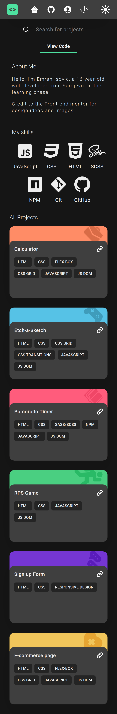
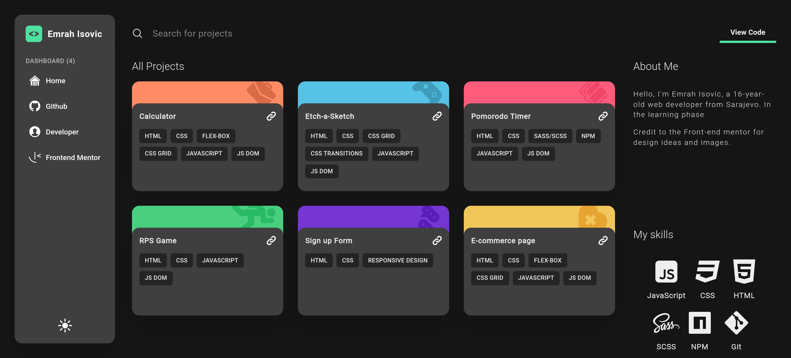

# Admin-dashboard
Final project from the The Odin project Intermediate HTML and CSS course to practice Responsive design and CSS Grid. 
I made small changes to the project and presented my admin-dashboard project as a small portfolio.

## Table of concepts
- [Overview](#overview)
  - [Screenshot](#screenshot)
  - [Links](#links)
- [Built with](#built-with)
- [Author](#author)

## Overview

### Screenshot

    - Mobile

  - Desktop

### Links
  - Live preview - [Admin-dashboard](https://emrahiso.github.io/Admin-dashboard/)
  - GitHub repo - [Admin-dashboard Repo](https://github.com/EmrahIso/Admin-dashboard.git)

## Built with 
  - HTML
  - CSS
  - FlexBox
  
## Author

- GitHub - [@EmrahIso](https://github.com/EmrahIso)

Credits to Frontend Mentor for design idea - [Frontend Mentor](https://www.frontendmentor.io/home)